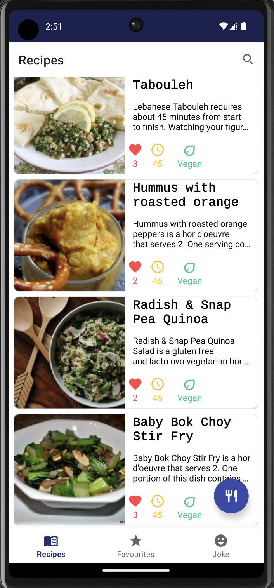
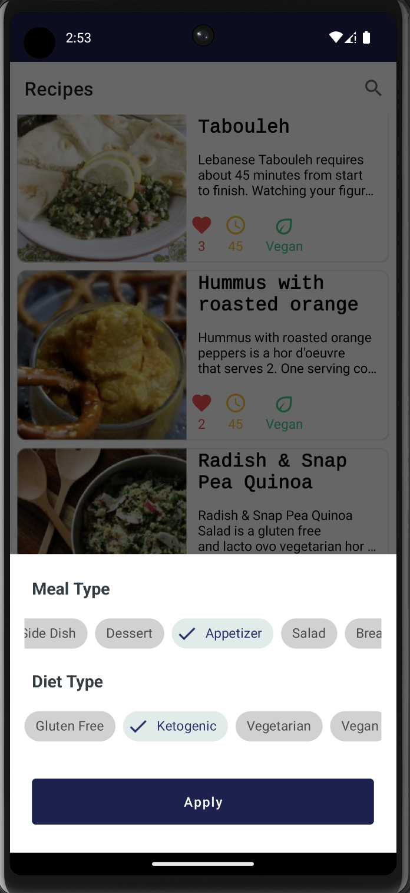
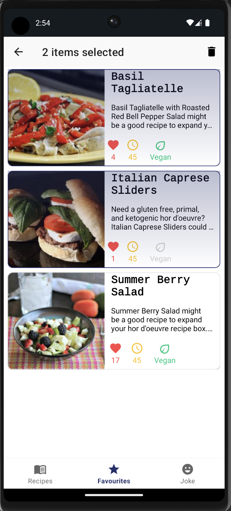
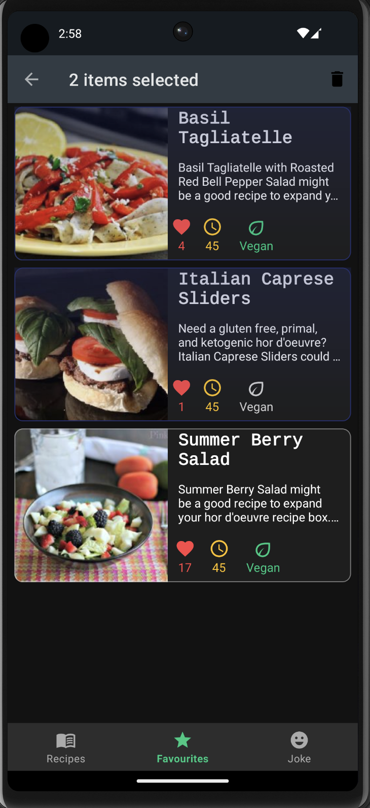

# About the App

**My Recipes** is a sample android app to 📱search 🥙Food recipes using Spoonacular API. This app is made to apply the *Modern Android development tools and practices*. It is built using Kotlin and MVVM clean architecture principles and is an offline first app. 

## Features
- Search recipes through food name.
- Search food by applying combinations of Meal type and Diet type.
- View food details and the ingredients needed to preapare.
- Save favorite recipes. 
- Food tivia.

## Built with
- [Kotlin](https://kotlinlang.org/) - First class and official programming language for Android development.
- [Coroutines](https://kotlinlang.org/docs/reference/coroutines-overview.html) - For asynchronous and more.
- [Android Architecture Components](https://developer.android.com/topic/libraries/architecture) - Collection of libraries for designing maintainable and testable apps.
    - [ViewBinding](https://developer.android.com/topic/libraries/view-binding) - Generates a binding class for each XML layout file present in that module and allows to write code that interacts with views.
    - [ViewModel](https://developer.android.com/topic/libraries/architecture/viewmodel) - Stores UI-related data that isn't destroyed on UI changes. 
    - [Flow] (https://developer.android.com/topic/libraries/architecture/coroutines#restart) - Asynchronous data stream that can be observed.
- [Navigation Component](https://developer.android.com/guide/navigation/principles) - Enables to implement app navigation using Navigation graphs, safe args and more.
- [Room](https://developer.android.com/training/data-storage/room) - Storage library allowing access to SQLite for persistent local storage.  
- [Hilt](https://developer.android.com/training/dependency-injection/hilt-android) - Dependency Injection Framework
- [Retrofit](https://square.github.io/retrofit/) - A type-safe HTTP client for Android and Java.
- [GSON](https://github.com/google/gson) - A Java serialization/deserialization library to convert Java Objects into JSON and back.
- [GSON Converter](https://github.com/square/retrofit/tree/master/retrofit-converters/gson) - A Converter which uses Gson for serialization to and from JSON.
- [Glide](https://github.com/bumptech/glide) - An image loading and caching library for Android focused on smooth scrolling.

## Screenshots

